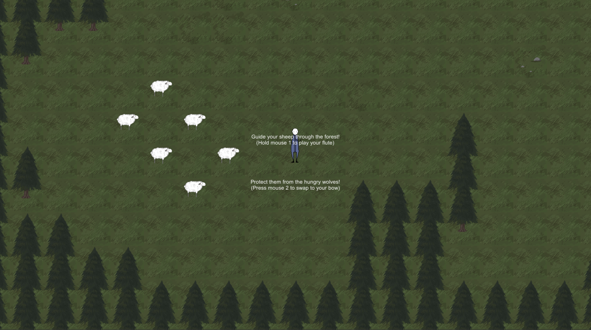

# GameJam-Shepard
This was a 3-person team project from a game jam at Pelitalo Score (A Finnish gaming-related youth activity center). I don't remember what the theme of the jam was. Maybe horror? About 15-20 hours were spent on it over a few days.

## Plot
You're a sheep herder, sheparding your sheep along a forest path between towns. Seems like a pack of wolves has migrated into the area, and they're howling hungrily not too far from the path. The best you can do is pipe along to your sheep... and if anything shows up, you've always got your bow.

## Features
- a text-to-map converter (source not included because I couldn't contact the other dev)
  - he used an external image-to-text tool which allowed him to create an image and then paste it directly into the source
  - it would parse a file and instantiate objects based on the characters

- one level
  - very *extremely* basic sheep AI, which would make the sheep follow the player while they played a flute
  - Music when the flute is played (intro to "Men Down Under", played with an actual flute)
  - very basic wolf AI, which would make the wolves chase the first sheep that entered its range, then kill it and start chasing another sheep after a short moment
  - cute bouncing movement animation for the sheep
  - more aggressive bob for the wolves
  - an item-swap between the flute and the bow
  
  
